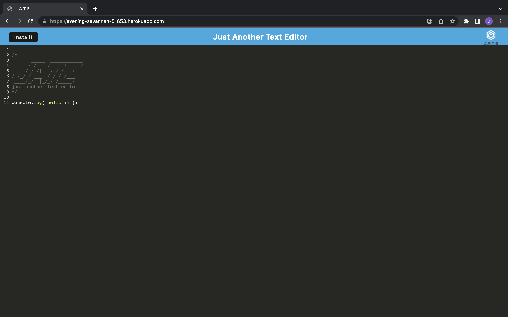

# Text-Editor

  

  ## Description 
  The PWA allows users to be able to create notes on or offline.

  ## Installation
  Download all files from this repo. `npm i` in the root of the repo to install all npm packages. Then `npm start:dev` in the terminal. Once that starts go to `http://localhost:3000/` to start the app. Then you can choose to install the app.

  ## Usage
  Use the editor however you like. It is in js format. It will save automatically.

   ## Screenshot

  

  ## License
  The license that is used for this project is: MIT License

  For more information please go to: https://choosealicense.com/licenses/mit/

  ## Questions
  GitHub Username: dcontrer83@yahoo.com

  Link to GitHub profile: [dcontrer83@yahoo.com GitHub Profile](https://github.com/dcontrer83@yahoo.com)

  Email Address: dcontrer83@yahoo.com

